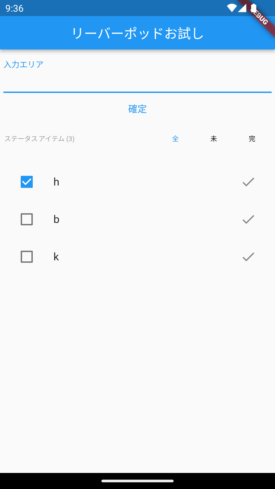
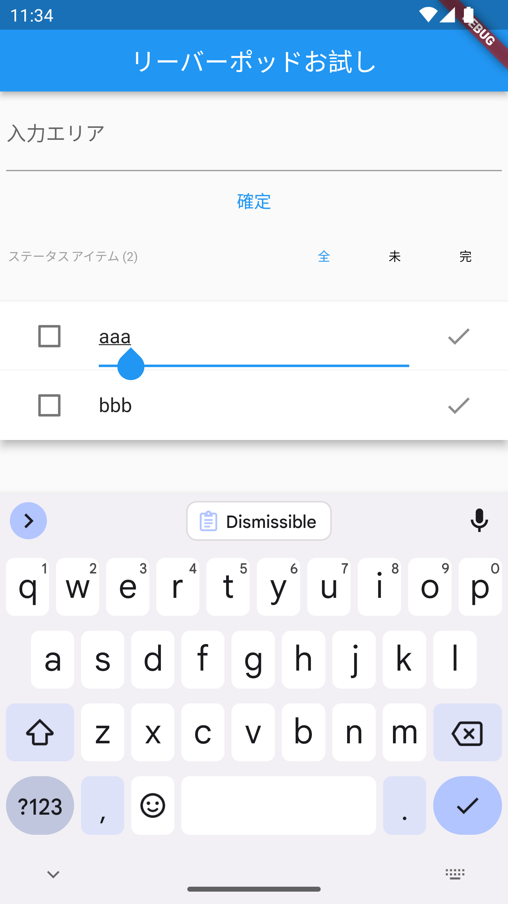
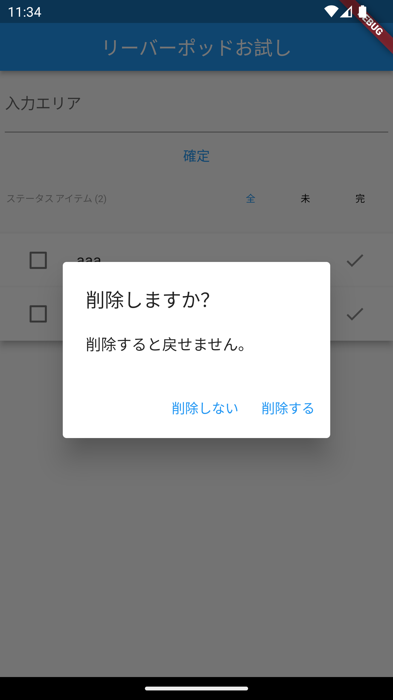

# flutter riverpod

flutter riverpod のお試し

flutter provider で作成したお試し todo を riverpod 化

## 主な利用 Widgets

- Riverpod

## 基サイト

(a) <https://riverpod.dev/docs/providers/state_notifier_provider>
(b) <https://github.com/rrousselGit/riverpod/tree/master/examples/todos>

provider 版の todo を(a)を基に riverpod 化し、その後(b)を参考に filter 機能 や Focus を組み込む。

## イメージ

## 未対応

- done: アイテム数表示
- done: Focus()
- done: 削除確認

(b)ではエントリーの削除に Dismissible を利用しているが、代わりに IconButton と showDialog()で削除確認するようにしている。

